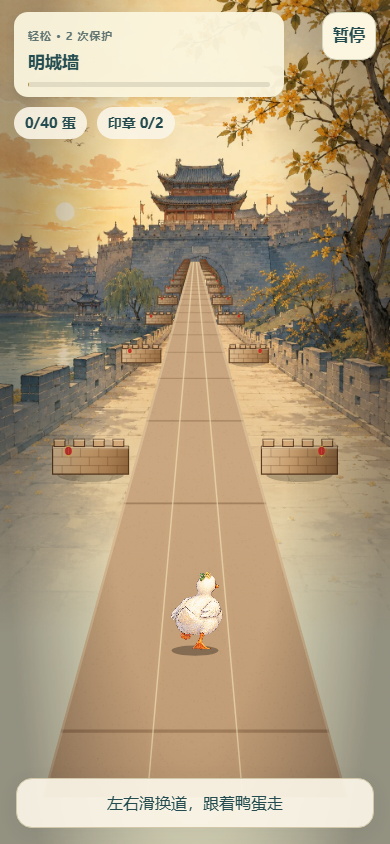
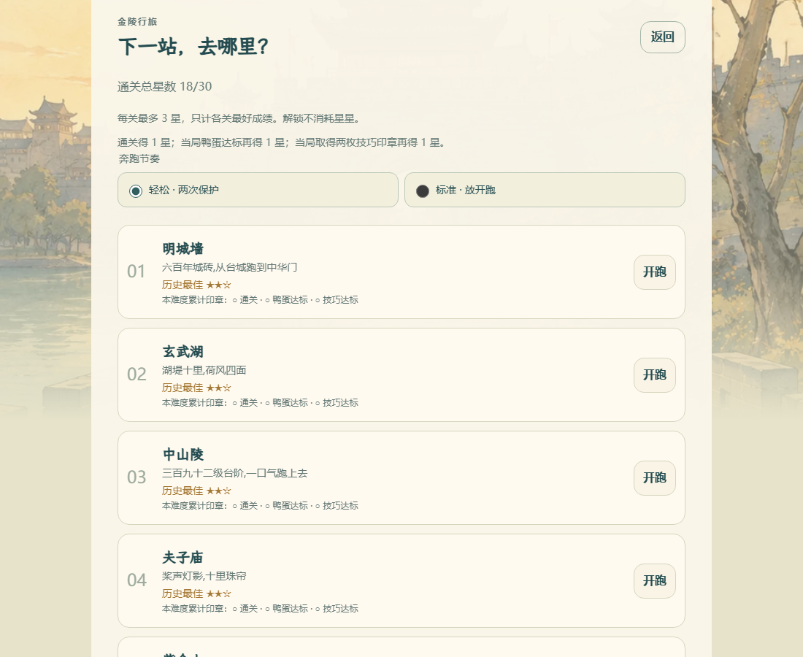
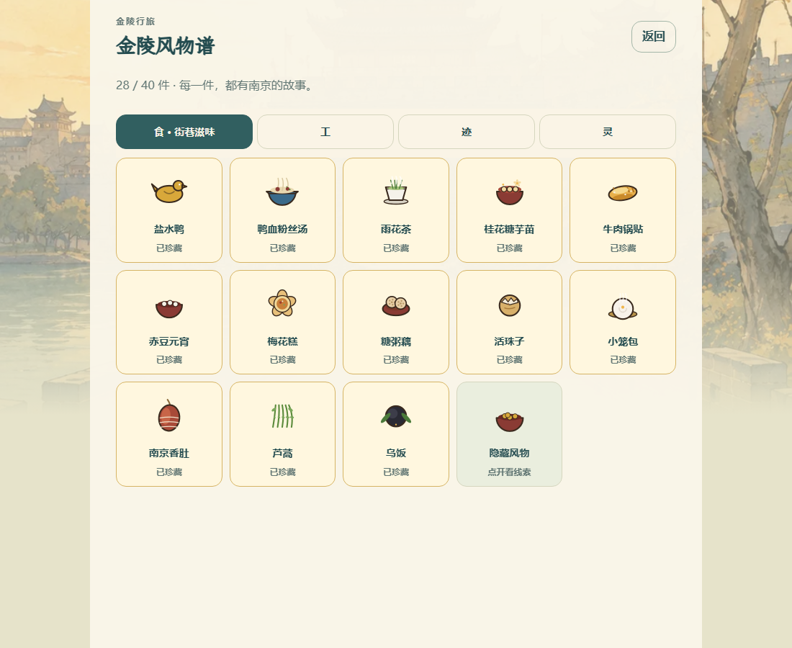

<p align="center">
  
</p>

<p align="center"><strong>带一只逃出鸭店的白胖鸭，跑遍金陵十景。</strong></p>

<p align="center">南京城市跑酷 · 十站旅程 · 四十件风物 · 手机竖屏开玩</p>

<p align="center">
  <a href="#一趟有点狼狈的金陵之旅">看看怎么玩</a> ·
  <a href="#本地开跑">本地开跑</a> ·
  <a href="#创作与授权">创作与授权</a>
</p>

> **开始游玩** · [jinlingrun.caowenhu.com](https://jinlingrun.caowenhu.com/) · 免费网页游戏，无需安装。

## 一趟有点狼狈的金陵之旅

《冲鸭！金陵！》是一款南京城市主题的浏览器跑酷小游戏。左右换道、起跳、滑铲，带着白胖鸭穿过城门、街巷与桥梁，顺路把南京的吃食、手艺、古迹和生灵收进风物谱。

腿短一点，也能跑很远。撞墙了，就再来一趟。

<p align="center">
  
</p>

### 十站，不止一张背景

从明城墙出发，经玄武湖、中山陵、夫子庙、紫金山、颐和路、老门东、栖霞山、大报恩寺，最后挑战隐藏站长江大桥。第一站保留教学保护，第二站起需要主动换道、跳跃和滑铲，挑战之间留有舒缓段。首页可直接选择正常或轻松模式，并查看本关拿星目标。

通关得 1 星；当局鸭蛋达标加 1 星，完成两枚不同技巧印章再加 1 星。两种难度都能拿三星，只计各关历史最佳。长江大桥需要前九关全部通关、前九关合计至少 15 星、收集至少 28 种普通风物；选关页会逐项显示进度。

每关各有两项专属挑战。道路上的编号金色菱形标记提示挑战动作，完成整组才能获得一枚技巧印章；首页与选关页可查看本关要求，暂停页显示本局具体车道。新手练习撞上障碍会停下来，可重试该动作或跳过练习进入正式第一关。

<p align="center">
  
</p>

### 跑着跑着，把南京收进风物谱

**食、工、迹、灵**四部，共 40 件风物，包含 6 件按条件发现的隐藏收藏。插画负责认脸，文字讲来历；有合适实拍的条目还可打开照片、放大查看和追溯来源。

<!-- album-summary:start -->
全部 40 件风物均有检索结论。当前采用 30 张：准确实拍 23；现场纪实 3；复原展示 1；相关示意 3；照片暂缺 10。
<!-- album-summary:end -->

<p align="center">
  
</p>

*以上均为当前游戏的本地浏览器实截。选关与图鉴使用展示存档，已解锁部分内容，不代表真人通关记录。*

### 还有几件小事，值得再跑一次

- **换一身金色。** 各关历史最好星级合计达到 15 星，解锁金鸭；换装不消耗星数。
- **路上捡点好东西。** 收集鸭蛋，在鸭铺升级磁铁、护盾与金桂道具。
- **跑累了随时歇。** 旋转屏幕或切到后台会暂停，声音和动态效果可分别调整。
- **带张成绩卡走。** 结算后生成分享卡，二维码带朋友回到游戏入口。
- **十站之外继续跑。** 无尽模式保留里程挑战与风物收集。

## 本地开跑

已取得仓库访问权限的开发者，在项目根目录运行：

```bash
python -m http.server 8000
```

浏览器打开 **[localhost:8000](http://localhost:8000/)**。源码可直接运行，无需先安装 npm 依赖或打包。请通过 HTTP 访问，双击 HTML 的 `file://` 方式无法加载 ES Modules。

| 动作 | 手机 | 键盘 |
| --- | --- | --- |
| 换道 | 左右滑 | ← / → 或 A / D |
| 跳跃、二段跳 | 上滑，再上滑 | ↑、W 或空格 |
| 滑铲、空中快降 | 下滑 | ↓ 或 S |
| 暂停 | 右上角暂停 | P 或 Esc |

进度保存在当前浏览器。换设备或从旧网址迁移前，在「设置与存档」中导出；进入新入口后导入。

## 引擎很轻，南京很满

原生 JavaScript ES Modules、Canvas 2D 绘制、WebAudio 合成声音，**没有框架和 npm 运行时依赖**。界面使用原生 HTML；照片按需同源加载；玩法与内容配置集中管理。

开发检查使用 Node.js 22、Python 和 Playwright：

```bash
npm ci
npm ci --prefix tools/e2e
node tools/e2e/node_modules/playwright-core/cli.js install chromium webkit
npm run verify
```

`npm run build` 生成内部试玩包；`npm run build:production` 生成正式制品，并校验素材发布审核。部署使用经过验证的版本化 `dist/`，源码直接运行与正式发布分开处理。

- [开发与素材维护](docs/development.md)：完整操作、字体、照片处理与命令。
- [项目结构](STRUCTURE.md)：游戏模块与数据流。
- [图鉴照片核验](ALBUM-REVIEW.md)：采用、缺图及示意性质的逐项说明。
- [部署与回滚](docs/deployment/edgeone.md)：EdgeOne Pages 发布、缓存和版本回退。

## 创作与授权

由 **曹文虎**组织创作，使用 AI 辅助开发与视觉制作。这是个人创作的南京主题游戏，与南京市政府、景区或文旅机构无隶属关系，不代表官方授权或背书。

部分历史鸭子、障碍及派生图标：**Created with Grok**。当前绘本角色与场景使用 OpenAI 图像生成辅助制作；具体记录见 [素材说明](ASSETS.md)。

**游戏原创部分保留所有权利，本仓库不采用开源许可证。** 欢迎通过正式入口游玩，也欢迎注明游戏名的个人非商业截图、录屏和成绩分享；代码、角色或作品的其他使用请先取得授权。详见 [著作权声明](LICENSE.md)。

第三方照片与字体继续遵守各自许可：照片保留作者、来源、许可和处理记录，CC BY-SA 衍生版本继续使用相同许可；马善政楷书与霞鹜文楷按 SIL OFL 1.1 使用。游戏的权利声明不覆盖这些素材的原有授权。

[照片署名](assets/album/CREDITS.md) · [背景照片署名](assets/img/CREDITS.md) · [字体许可](assets/fonts/OFL.txt) · [联系作者](https://github.com/mckf111)

---

<p align="center">桂花别掉，鸭蛋带好。下一站，金陵。</p>
