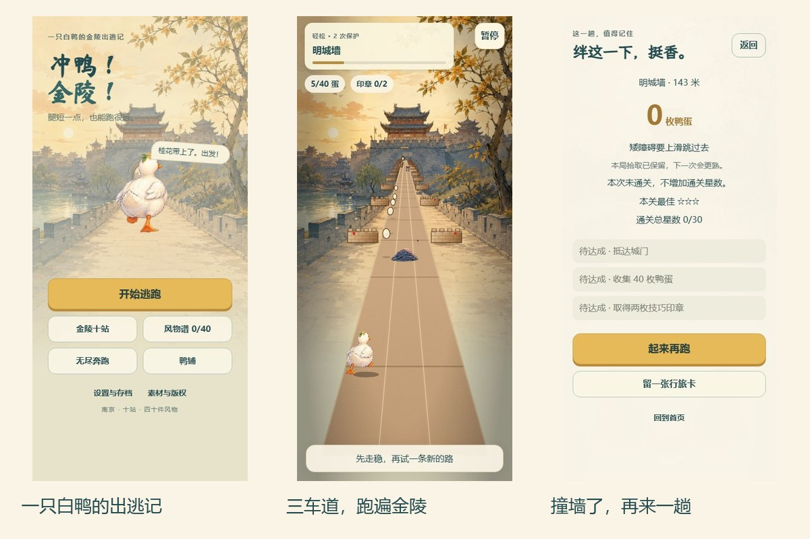
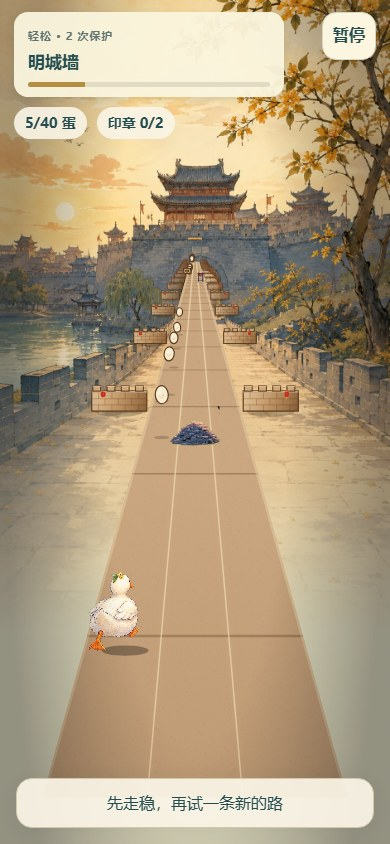
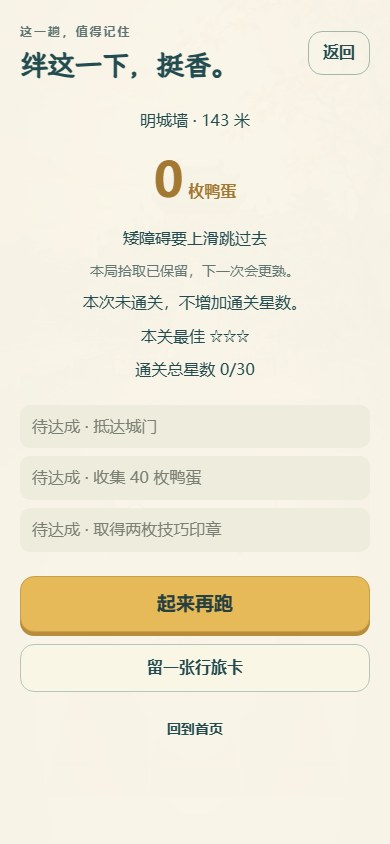
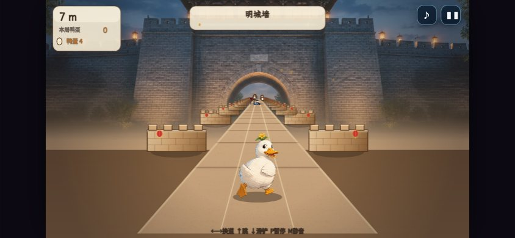

# 微信公众号宣传文章

> **文章定位**：个人独立项目分享，不代表南京任何机构，也不是官方宣传。
>
> **证据基线**：2026-09-07 当前绘本版及重新截取的本地浏览器画面；正式入口固定为 `https://jinlingrun.caowenhu.com/`，上线与实机状态以配套发布检查单为准。合成封面、浏览器截图和实体手机验收分别标注。

## 推荐标题

1. **我做了一只在南京城门里反复撞墙的白鸭**（推荐）
2. 冲鸭！金陵！：我把南京城门做成了一场短跑
3. 一只鸭，十站金陵，一路跑一路收集
4. 做一个不用安装的南京跑酷游戏，先从一堵墙开始
5. 我为什么让一只白鸭跑过明城墙，而不是做一个景点相册

## 摘要

我做了一个打开网页就能玩的南京城市跑酷小游戏。白鸭从明城墙起跑，用换道、跳跃和滑铲穿过障碍，顺便捡一点金陵风物。它还不适合被叫作“上线大作”，但已经足够让我邀请你来撞第一堵墙。

## 正文

### 先说我为什么做它

我一直觉得，南京很适合被做成一个跑酷游戏。这里的城市记忆不是一张地标合影就能装下的东西。城门有厚度，秦淮的灯影有节奏，老门东的巷子有方向，鸭子则负责把一切弄得不太严肃。

所以我做了《冲鸭！金陵！》。主角是一只认真逃跑的白鸭，目标不是讲完南京文化，而是让玩家很快看见一点金陵的空间和风物，然后做出一个动作。游戏有十站路线和四十件风物图鉴，技术上是原生 JavaScript、Canvas 2D 和 Web Audio，没有账号和后端。[1]

我还想试试，一个人能不能把“城市印象”翻译成可操作的规则，而不是只换一张背景图。做完以后发现，鸭子比我想象中更容易撞墙，规则也比文案诚实。

*封面图：用游戏现有桂花鸭、城门绘本素材与标题排版合成，非游戏截图；实际玩法画面见后文浏览器实截。*

### 打开网页，带上白鸭出发

第一次打开，手机竖屏就能玩，桌面浏览器也可以。点击“开始逃跑”，从第一站明城墙出发；已有进度时，首页会显示“继续旅程”。操作引导会说明整堵墙要换道、矮障碍要跳、高横梁要滑铲，也能练习二段跳。键盘用方向键或 WASD；触屏则是左右滑换道、上滑跳、下滑铲。右上角可以暂停，声音在“设置与存档”中调整。

入口没有注册、下载或复杂设置，点两次就能见到第一条教学提示。真正需要记住的是下一堵墙在中间还是旁边。按错后会看到对应死因，教学阶段也会给出临时护盾，让你再试一次。

| 你看到的情况 | 需要做的动作 |
|---|---|
| 中间是一整堵墙 | 左右换道 |
| 路面上的矮障碍 | 上滑或按 ↑ 跳过 |
| 头顶的横梁 | 下滑或按 ↓ 滑铲 |
| 起跳后需要更高一点 | 再按一次 ↑，完成二段跳 |

*三张浏览器实截依次是首页、竖屏跑局和自然失败结算。跑局使用展示存档；不是实体手机测试记录，也不是动作分解图。*

### 南京元素要进入玩法，不能只站在后面拍照

第一站明城墙不是把照片铺在后面。三条跑道、城墙和门洞决定了换道时机，亮起的门洞也给出空间判断。中华门多道瓮城门的空间顺序是设计来源；游戏表现是原创门洞与障碍组合，不是文物复刻，也不代表机构授权。[2] [3]

其他路线也不是随机换名字。玄武湖、中山陵、夫子庙、紫金山、颐和路、老门东、栖霞山、大报恩寺和长江大桥都有对应场景。每站有六段节奏、收集目标和技巧印章，提供轻松与标准两档难度。跑动中既能收集鸭蛋，也能发现风物；盐水鸭、雨花茶、云锦、秦淮花灯、石象路、梅花和樱花都在风物谱里。照片、字体和许可说明可以在“素材与版权”页面查看。[1] [4] [5]

### 开发中真正解决过的问题

一个实际要解决的问题是“玩家为什么死”。当前版本把撞击类型和提示接起来：撞上整墙，会提示“整堵墙只能换道”；撞到高横梁，则提示滑铲。失败页还显示距离和鸭蛋，并把“起来再跑”放在最显眼的位置。我在实际浏览器里故意不操作，确实走到了这个结算页。[6]

另一个问题是教学要允许犯错。操作引导会配合对应障碍，失误后可以再练这一步，不必每次回到菜单。轻松模式也提供两次保护，熟悉操作后再切到标准模式。这样至少不用靠猜系统的脾气。[6]

### 它适合谁玩

它适合想用一两分钟摸手感、对南京地标和城市小吃有兴趣的人，也适合喜欢把动作练到稳定过墙的人。

它目前以单人跑酷和风物收集为主，没有复杂剧情、联机或排行榜。手机竖屏直接玩，也兼容横屏和键盘；旋转或切到后台时会暂停。浏览器自动化与真实手机微信验收分开记录，不把模拟结果当作所有手机都已验证。[7]

### 现在能不能玩

当前仓库本地可以实际走通菜单、选关、教学、正式跑局、失败、暂停、重开和分享入口。分享成绩会生成 600×760 的成绩卡；非微信环境优先尝试系统分享或下载，微信环境显示图片遮罩，提示长按保存，并提供复制链接入口。[8]

正式网址已经部署到 EdgeOne Pages，使用固定 HTTPS 入口。浏览器上线检查已通过；文章群发前，我还会在真实微信预览中走一遍进入游戏、操作、前后台恢复和分享，避免读者点开后遇到不一致的体验。[7]

*浏览器实截：当前仓库 main 分支本地运行的正式第一关画面。*

*浏览器实截：真实失败结算页，展示死因、距离、鸭蛋和重开入口。*

*浏览器实截：390×844 自动化浏览器竖屏视口；不代表实体手机或微信 WebView 已验证。*

**试玩入口：[冲鸭！金陵！](https://jinlingrun.caowenhu.com/)。** 在公众号后台把这条网址填入“阅读原文”。

*点击文末“阅读原文”，或长按二维码，带白鸭跑一趟金陵。二维码已独立解码核验；文章发布前仍需在真实微信预览中打开验证。*

## 配套发布文案

### 朋友圈短文案

我做了一个不用安装的南京城市跑酷小游戏。白鸭从明城墙起跑，换道、跳跃、滑铲，路上捡一点金陵风物。试玩地址是 https://jinlingrun.caowenhu.com/ 。【作者发布前删除此提示：请先在真实微信预览中确认入口和游玩正常。】

### 图片说明

封面：白鸭站在明城墙门洞前，标题使用“我做了一只在南京城门里反复撞墙的白鸭”。画面只保留游戏中已经存在的白鸭、明城墙、三条跑道和门洞，不新增不存在的角色或场景。

核心玩法图：由当前菜单、竖屏正式跑局与自然失败结算三张浏览器截图组成，展示从开始到重试的流程；不是操作动作分解图。

浏览器实截 1：当前版本菜单与“开始逃跑”“无尽奔跑”“风物谱”“鸭铺”等入口。

浏览器实截 2：第 1 站“明城墙”的操作引导画面，展示白鸭、城门、跑道和底部操作提示。

浏览器实截 3：正式跑局画面，展示旅程进度、鸭蛋、技巧印章、暂停按钮和前方障碍。

浏览器实截 4：自然失败结算页，展示按死因给出的提示、距离、鸭蛋以及“起来再跑”“留一张行旅卡”入口；复制链接位于分享层。

## 参考资料

[1]: ../../src/config.js "关卡、路线、风物和模式配置"
[2]: https://wlj.nanjing.gov.cn/ztzl/mcq/gzqk/202302/t20230228_3838766.html "南京市文化和旅游局：小课堂｜天下第一瓮城——南京城墙中华门"
[3]: ../../src/legal.js "游戏内素材与授权说明"
[4]: https://www.njqh.gov.cn/dmqh/yzqh/qhhssylx/ "南京市秦淮区人民政府：景区历史｜秦淮河"
[5]: ../../assets/img/CREDITS.md "图片作者与许可清单"
[6]: ../../src/game.js "教学、碰撞、失败反馈与重开状态机"
[7]: ./wechat-publish-checklist.md "微信发布验收边界与未完成项"
[8]: ../../src/share.js "成绩卡、分享、微信内遮罩和复制链接实现"
